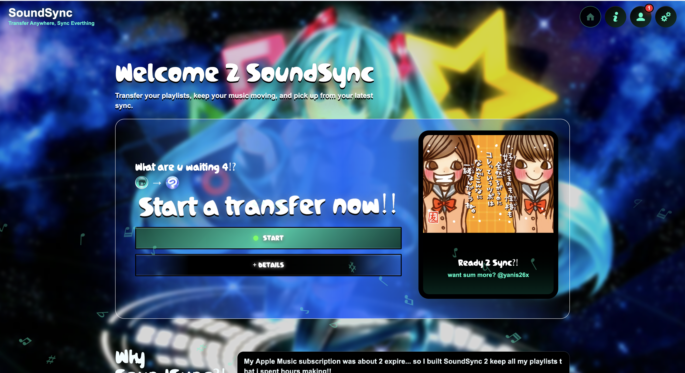

# SoundSync

SoundSync is a web app for transferring playlists between music platforms.



## Demo

Watch the SoundSync demo: https://youtu.be/tJKpbC9Y5h0?si=ItnZFTKHvtdLyNgU

## Run The Project

### Backend

```bash
cd backend
npm install
npm run dev
```

Backend URL:

```txt
http://127.0.0.1:8000
```

### Frontend

```bash
cd frontend
npm install
npm run dev
```

Frontend URL:

```txt
http://localhost:5173
```

## Configuration

Create a `.env` file inside the `backend` folder:

```env
PORT=8000

# Spotify
SPOTIFY_CLIENT_ID=your_client_id
SPOTIFY_CLIENT_SECRET=your_client_secret
SPOTIFY_REDIRECT_URI=http://127.0.0.1:8000/auth/spotify/callback

# Google / YouTube
GOOGLE_CLIENT_ID=your_google_client_id
GOOGLE_CLIENT_SECRET=your_google_client_secret
GOOGLE_REDIRECT_URI=http://127.0.0.1:8000/auth/google/callback
```

For Apple Music support, add your `.p8` MusicKit key file inside the `backend` folder and configure the matching backend values.

## Spotify Setup

In the Spotify Developer Dashboard, add this Redirect URI:

```txt
http://127.0.0.1:8000/auth/spotify/callback
```

## YouTube / Google OAuth Setup

In Google Cloud Console, add this authorized redirect URI:

```txt
http://127.0.0.1:8000/auth/google/callback
```

If your Google app is in testing mode, add your test users here:

```txt
Google Cloud Console
Google Auth Platform
Audience
Test users
Add users
```

## Credits

Developed by `@yanis26x`.

## License

This project is licensed under the **Creative Commons Attribution-NonCommercial 4.0 International License (CC BY-NC 4.0)**.

You may view, share, and modify it as long as you **credit the author (`yanis26x`)** and **do not use it for commercial purposes**.

[Read the full license](https://creativecommons.org/licenses/by-nc/4.0/)

---

<p align="center">© 2026 <b>yanis26x</b> · All rights reserved</p>
